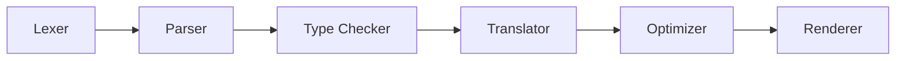

The Amber compiler follows a standard compilation pipeline to transform Amber source code into Bash scripts.



1.  **Lexer**: Transforms source code text into a stream of tokens (Keywords, Operators, Identifiers, etc.).
2.  **Parser**: Consumes tokens to build an Abstract Syntax Tree (AST), representing the code structure.
3.  **Type Checker**: Traverses the AST to validate types, ensure safety, and infer missing type information.
4.  **Translator**: Converts the typed AST into an intermediate representation called `FragmentKind` (Lower IR).
5.  **Optimizer**: Performs optimizations on the intermediate representation.
6.  **Renderer**: Converts the final IR into the target Bash string.

Here you will find out how the compiler is structured, how the parser works and how to write new syntax modules. Let's begin!

## Lexer

Beforehand the code is transformed into an array of tokens that contain information about:
- `word` - the token content
- `pos` - the token location in the document (row, column)
- `start` - the index in the code string where the token starts

```rs
struct Token {
    word: String,
    pos: (usize, usize),
    start: usize
}
```

Tokens are created with lexical rules that are contained in the [src/rules.rs](https://github.com/amber-lang/amber/blob/master/src/rules.rs) file.

Here is the example of how an array of Amber tokens can look like, where strings represent instances of `Token`:
```js
[Token<"let">, Token<"is_alive">, Token<"=">, Token<"true">, ...]
```

## Parser

Parser takes in Tokens and forms an Abstract Syntax Tree that represents the code written in Amber.

### Syntax Module

What transforms tokens into the AST (Abstract Syntax Tree) is a `SyntaxModule`. It can be a `Text` literal, `echo` builtin or `Add` operator. The `SyntaxModule` is a trait that implements:
- `parse` method that parses the module and determines whether or not the corresponding token string represents this sytax module. If otherwise, then a `Failure::Quiet` is returned that means that this is not the correct module to parse the tokens. However if this is the correct module but an error is encountered, then `Failure::Loud` is returned with an error (or warning / info) is returned.
- `new` method that instantiates a new SyntaxModule.
- `syntax_name!("<name of this module>")` that identifies this syntax module with its name.

The most important method here is `parse` that is defined with the following signature:

```rs
fn parse(&mut self, meta: &mut M) where M: Metadata -> SyntaxResult;
```

Parsing returns a `SyntaxResult` that under the hood is represented as `Result<(), Failure>`. It means that parsing can be finished successfully or it can fail returning a `Failure` object.

Here is an example `SyntaxModule` that parses `Bool` literal:
```rs
impl SyntaxModule<ParserMetadata> for Bool {
    syntax_name!("Bool");

    fn new() -> Self {
        Bool {
            value: false
        }
    }

    fn parse(&mut self, meta: &mut ParserMetadata) -> SyntaxResult {
        let value = token_by(meta, |value| ["true", "false"].contains(&value.as_str()))?;
        self.value = value == "true";
        Ok(())
    }
}
```

### Metadata

You can see that in the `parse` method mentioned above we pass some object called `meta`. This is a metadata parameter of type `ParserMetadata` that inherits from `Metadata` provided by Heraclitus. The structure instance is carried through the parsing process to keep a track of current state. It holds information such as declared variables, functions, boolean parameters telling if current context is within a loop or a function etc. `ParserMetadata` is represented as:

```rs
struct ParserMetadata {
    // Parsing contenxt
    pub context: Context
    // Error / Warning messages
    pub messages: Vec<Message>
    // ...
}
```

You can find out more about this structure in [src/utils/metadata/parser.rs](https://github.com/amber-lang/amber/blob/master/src/utils/metadata/parser.rs) file.

### Parsing Flow

The journey starts with parsing the global `Block` that can be located in [src/modules/block.rs](https://github.com/amber-lang/amber/blob/master/src/modules/block.rs) file. The `Block` parses a sequence of statements (`Statement` located in [src/modules/statement/stmt.rs](https://github.com/amber-lang/amber/blob/master/src/modules/statement/stmt.rs)).

#### Statement

Statement (`Statement`) is a structure that can represent any `SyntaxModule` that is of statement type. In other words Statement is a wrapper for syntax modules that represents a statement type such as loop, if condition, variable declaration etc.

```rs
struct Statement {
    value: Option<StmtType>
}
```

Here we can see that the `value` field accepts `StmtType` enum that is declared above and represents a syntax module.

```rs
enum StmtType {
    Expr(Expr),
    VariableInit(VariableInit),
    VariableSet(VariableSet),
    IfCondition(IfCondition),
    // ...
}
```

Statement is built of a macro `parse_statement!` that can be located in [src/modules/statement/stmt.rs](https://github.com/amber-lang/amber/blob/master/src/modules/statement/stmt.rs). The syntax modules provided to the macro are parsed sequentially in the order from top to bottom. This means that the parser will first try to match `Import` and then `FunctionDeclaration`. The expression  (`Expr` located in [src/modules/expression/expr.rs](https://github.com/amber-lang/amber/blob/master/src/modules/expression/expr.rs)) is passed as the final parameter to the `parse_statement!` macro so that it's parsed at the very end.

```rs
parse_statement!([
    Import,
    FunctionDeclaration,
    // ...
    Expr
], ...);
```

This macro iterates through the provided syntax modules and attempts to parse them one by one. If a module successfully parses the code, the loop breaks and the result is returned.

The `StatementDispatch` derive macro is used on the `StmtType` enum to automatically generate dispatch methods for traits like `TranslateModule`, `TypeCheckModule`, etc. preventing the need to verify matches manually.

#### Expr

Expression (`Expr` located in [src/modules/expression/expr.rs](https://github.com/amber-lang/amber/blob/master/src/modules/expression/expr.rs)) represents a syntax that is a value of certain type (also referred to as _kind_ because of the Rust's type keyword). For example `1 + 1` is an addition of type `Num`.

```rs
struct Expr {
    // The value of the expression
    value: Option<ExprType>,
    // The type of the expression
    kind: Type,
    // The position of the expression
    position: Option<PositionInfo>
}
```

Analogically to `Statement`, expression also is a wrapper for syntax modules that are of expression type. Instead of `StmtType` enum `ExprType` is declared.

```rs
enum ExprType {
    Bool(Bool),
    Number(Number),
    Text(Text),
    Add(Add),
    Sub(Sub),
    // ...
}
```

Since certain expressions require different approaches to parsing, there is a different macro used here to automate the process. There are a couple of different types of expressions:
- `TernOp` - a ternary operator that is parsed from right to left. It's used for conditional ternary operator.
- `BinOp` - a binary operator that is parsed from left to right.
- `UnOp` - a unary operator that is parsed from left to right, where the symbol expression is on the left side.
- `TypeOp` - a binary expression that is represented as expression followed by operator and then a type. Example of such operator is a cast operator: `12 as Bool`.
- `Literal` - a Literal that doesn't have any directional precedence. Literal is the final group of expression precedence.

The hierarchy of the groups is represented within the `parse_expression!` macro (defined in [src/modules/expression/macros.rs](https://github.com/amber-lang/amber/blob/master/src/modules/expression/macros.rs)). It returns an Expr` that has been parsed.

begin[details] How exactly does parsing expressions work?

```rs
let result = parse_expression!(meta, [
    ternary @ TernOp => [ Ternary ],
    range @ BinOp => [ Range ],
    addition @ BinOp => [ Add, Sub ],
    multiplication @ BinOp => [ Mul, Div, Modulo ],
    types @ TypeOp => [ Is, Cast ],
    unops @ UnOp => [ Neg, Not ],
    literals @ Literal => [ Bool, Number, Text ]
]);
```

The pattern that the macro follows can be represented as `<function_group_name> @ <group_type> => [<syntax_modules>]`. The macro is declared as a recurrent relation of functions (groups) that are calling each other (inside of an internal macro `parse_expr_group!`).

```rs
let result = {
    fn _terminal(...) {
        panic!("Please end the recurrence in the group before");
    }

    fn literal(...) {
        parse_expr_group!(... {literal, _terminal} ...);
    }

    // ...

    fn range(...) {
        parse_expr_group!(... {range, addition} ...);
    }

    fn ternary(...) {
        parse_expr_group!(... {ternary, range} ...);
    }

    return ternary(...);
};
```

The main objective of `parse_expr_group!` is to implement given function's body with appropriate parsing mechanism. If it's a `BinOp` that parses from left to right, then first we parse left expression by calling the lower order group, then we parse the operator, and then the right expression. You can read more on how parsing groups works in the macros file.

end[details]

### Type Checking

After the parsing phase is completed, the Compiler performs a Type Check that validates types of variables and expressions. This logic is contained within the `TypeCheckModule` trait located in [src/modules/typecheck.rs](https://github.com/amber-lang/amber/blob/master/src/modules/typecheck.rs).

```rs
pub trait TypeCheckModule {
    fn typecheck(&mut self, meta: &mut ParserMetadata) -> SyntaxResult;
}
```

This method is called after parsing but before translation. It allows the module to infer types, check for type mismatches, and mutate the module state (e.g. storing the inferred type) using the `ParserMetadata`.

### Translation

The next step is translating the AST into an Intermediate Representation (Fragments) which is structurally closer to the target language (Bash). This is handled by the `TranslateModule` trait located in [src/translate/module.rs](https://github.com/amber-lang/amber/blob/main/src/translate/module.rs).

```rs
pub trait TranslateModule {
    fn translate(&self, meta: &mut TranslateMetadata) -> FragmentKind;
}
```

This method takes `TranslateMetadata` and transforms the module into a `FragmentKind`.

### FragmentKind

`FragmentKind` is a crucial enum that represents a piece of generated code. It serves as an intermediate representation that abstracts over different types of Bash constructs before they are rendered into the final string. It is defined in [src/translate/fragments/fragment.rs](https://github.com/amber-lang/amber/blob/master/src/translate/fragments/fragment.rs).

```rs
pub enum FragmentKind {
    Raw(RawFragment),
    VarExpr(VarExprFragment),
    VarStmt(VarStmtFragment),
    Block(BlockFragment),
    Interpolable(InterpolableFragment),
    List(ListFragment),
    Subprocess(SubprocessFragment),
    Arithmetic(ArithmeticFragment),
    Comment(CommentFragment),
    Log(LogFragment),
    #[default] Empty
}
```

Its purpose is to provide structured generation of Bash code. For example:
- `VarExpr` handles variable access (like `$VAR`).
- `Subprocess` handles `$(...)` command substitutions.
- `Block` handles sequences of statements (like `{ ... }`).
- `Arithmetic` handles `(( ... ))` arithmetic contexts.

`FragmentKind` implements `FragmentRenderable` trait which allows it to be converted to a string. This is the final stage of compilation where Lower IR is rendered into actual Bash code:

```rs
fn to_string(self, meta: &mut TranslateMetadata) -> String;
```
